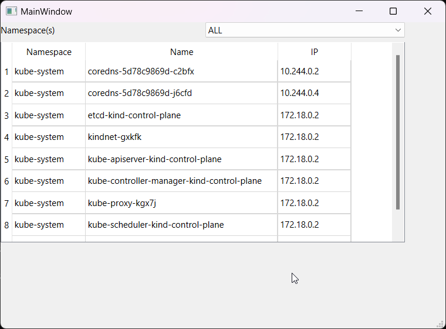

# kuboculus

- Kubernetes client to explore the cluster resources in GUI.
- Written in QT and Python to be cross-platform and native application without memory usage issues of Java.



This is an absolute beginner attempt at such a tool right now. Lets make it better in coming days

## Technologies

1. Python
1. pip3
1. Qt for Python


## Setup

1. setup venv
1. pip install pyside6 kubernetes
1. (optional) vscode with python plugin and .venv environment

## Run
Save file `kind.kubeconfig` in the current folder. Currently, the kubeconfig must be sourced from fixed file. In future, we will allow it to be selected dynamically / pass the file path as argument.
```shell
python kubeclient_ui.py
```

## Design the UI
1. Run the designer (.venv\Lib\site-packages\PySide6\designer.exe)
1. Load file trial-screen.ui